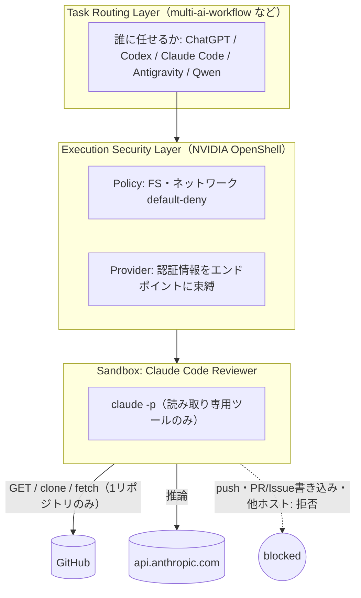

# openshell-claude-reviewer

> **このプロジェクトは、どのAIモデルを使うかを選びません。**
> **Claude Code レビュアーのための「セキュリティ実行境界」を提供します。**

[Claude Code](https://claude.com/claude-code) を [NVIDIA OpenShell](https://github.com/NVIDIA/OpenShell) の
サンドボックス内で**独立コードレビュアー**として実行します。「pushしないで」とプロンプトでお願いするのではなく、
**ポリシーで技術的にpush不可**にするのが目的です。

English: [README.md](README.md)

> **ステータス:** ポリシー・スクリプト・イメージ・ドキュメントはCIでlint済み。実機の検証
> (`scripts/verify-security.sh`) はDockerとゲートウェイが必要なため、手元のMacで実行して結果を記録してください。
> 実行するまで「検証済み」とは主張しません。[docs/verification.md](docs/verification.md)

## なぜOpenShellか

レビュアーに必要なのは、リポジトリを**読む**こととAnthropic APIを呼ぶことだけです。push・コメント・マージ・
任意のインターネット・`~/.ssh` は不要です。OpenShellはデフォルト拒否のサンドボックス、L7で検査するネットワーク
プロキシ、認証情報の実値をサンドボックスへ渡さないProviderを提供します。

## アーキテクチャ



詳細: [docs/architecture.md](docs/architecture.md) / [docs/security-model.md](docs/security-model.md)

## 脅威モデル（要約）

| 懸念 | 対策 |
|---|---|
| レビュアー（やレビュー対象コード内のプロンプトインジェクション）によるpush・GitHub変更 | APIは`GET`/`HEAD`のみ、gitは対象1リポジトリの`info/refs`と`git-upload-pack`のみ。`git-receive-pack`は明示deny |
| 任意ホストへの情報流出 | ネットワークdefault-deny。許可は`api.anthropic.com`・`github.com`・`api.github.com`のみ |
| ホストの秘密情報（`~/.ssh`等）の読み取り | コンテナ内サンドボックス、何もマウントしない。Landlock `hard_requirement`、非root |
| 環境変数からの認証情報窃取 | 環境変数は不透明なプレースホルダ。実値は束縛先エンドポイントへの通信時にプロキシが注入 |
| レビュアーが自分の権限を広げる | ポリシーはサンドボックスの外（ホスト）から設定 |

## 前提

- Apple Silicon Mac（macOS）、Homebrew
- Docker Desktop（起動済み、Engine 28+）。**ホストネットワーキングを有効化**（Settings → Resources → Network → *Enable host networking*）し、Enhanced Container Isolation はオフにする。無効だとSandboxのsupervisorがOpenShellゲートウェイに届かず `ControlSupervisorStartFailed ... failed to connect to OpenShell server` で失敗します。
- OpenShell（`scripts/setup.sh --install` がNVIDIA公式インストーラを実行）
- **Anthropic Console のAPIキー**（OpenShellのClaude Providerは`ANTHROPIC_API_KEY`を使用。サブスクリプション認証は非対応）
- 任意: GitHub fine-grained token（対象リポジトリのみ `Contents: read` + `Metadata: read`。privateリポジトリ用）

## セットアップ

```sh
git clone https://github.com/moruku36/openshell-claude-reviewer && cd openshell-claude-reviewer
scripts/setup.sh --install          # privateリポジトリも読むなら --with-github-token
```

`setup.sh` がレビュアーイメージのビルド、`profiles/` の2つのProfileインポート、環境変数からのProvider作成を行います。
`ANTHROPIC_API_KEY` が未設定なら非表示入力で聞かれます。値はディスク・引数・シェル履歴に残りません（コマンドに直接貼らないでください）。

## 使い方

```sh
scripts/review.sh https://github.com/moruku36/multi-ai-workflow            # publicリポジトリ
scripts/review.sh owner/private-repo --token --ref feature/x               # private / ブランチ指定
scripts/status.sh [sandbox名]        # ゲートウェイ・Provider・Sandbox・有効ポリシー・deny
scripts/cleanup.sh [--all]           # Sandbox削除（--all: Provider・Profile・イメージも）
```

レビューごとに新しい**使い捨て**サンドボックス（`--no-keep`）を作り、中でcloneして読み取り専用ツールだけでClaudeを実行、
レポートは`reports/`（git管理外）へ保存、終了時にサンドボックスと注入済み認証情報を削除します。
常駐Sandboxにしない理由: レビュー間で状態が残らず、汚染された実行が次回に影響しないためです。

レビュー観点は [prompts/reviewer.md](prompts/reviewer.md) で調整（イメージに焼き込み。変更後は`setup.sh`を再実行）。
プロンプトは補助であり、境界を作るのはポリシーです。

## セキュリティ検証

```sh
scripts/verify-security.sh [owner/repo] [--skip-claude]
```

使い捨てSandboxで次を確認し、`reports/verification-*.md` に記録します: Claude起動、Anthropic到達、clone/fetch/API GET許可、
`push --dry-run`拒否、API `POST`拒否、他リポジトリAPI拒否、未許可ホスト拒否、ホストパス不在、環境変数の認証情報がプレースホルダ、
`openshell logs`にdenyイベント。pushは`--dry-run`、API変更は空ボディでプロキシがdenyするため安全です。

## `multi-ai-workflow` との関係

[`multi-ai-workflow`](https://github.com/moruku36/multi-ai-workflow) は**誰に**任せるか（Task Routing）を決めます。
このリポジトリは、Claude Codeレビュアーという1つの役割について**そのAIに何を許可するか**（Execution Security）を担当します。
OpenShellはモデル階層でもAIルーターでもありません。重要なリポジトリ／セキュリティ重視のレビューで使い、
通常の軽いレビューは従来のClaude Codeで構いません。

## 既知の制限

- レビュー対象コードはAnthropic APIへ送信されます（仕様）。
- ポリシーは1回の実行につき1リポジトリに限定し、大文字小文字を区別します（`owner/repo`は正確な表記で）。
- Providerプロファイルのバイナリパスは`image/Dockerfile`の構成が前提です。Claude Codeの配布形態が変わったら
  `profiles/claude-code-reviewer.yaml`を調整（[troubleshooting](docs/troubleshooting.md)）。
- OpenShellはpre-1.0で変化が速く、コマンドは現行docsに準拠。`OPENSHELL_VERSION`で固定できます。
- プロンプトインジェクションでレビュー文面が誤誘導される可能性はありますが、書き込みは実行できません。
- 対象はApple Silicon + Docker Desktop。他環境は未検証です。

## トラブルシューティング

[docs/troubleshooting.md](docs/troubleshooting.md)

## ライセンス

MIT
