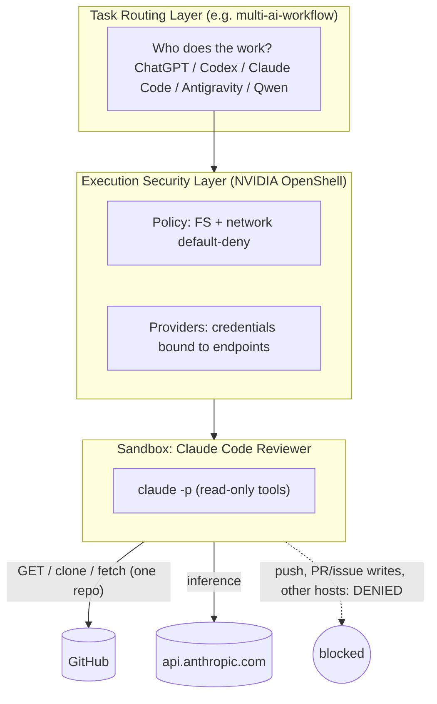

# openshell-claude-reviewer

> **This project does not choose which AI model to use.**
> **It provides a security execution boundary for Claude Code reviewers.**

Run [Claude Code](https://claude.com/claude-code) as an **independent code reviewer** inside an
[NVIDIA OpenShell](https://github.com/NVIDIA/OpenShell) sandbox, so that "the reviewer must not push"
is enforced by policy instead of by a prompt.

日本語: [README.ja.md](README.ja.md)

> **Status:** policy, scripts, image and docs are linted in CI. The live checks in
> `scripts/verify-security.sh` must be run on your machine (they need Docker + a gateway);
> recorded live checks are listed in [docs/verification.md](docs/verification.md). The latest run
> verified sandbox boundaries (13/13 checks); it did not verify Anthropic API access or a real review.

## Why OpenShell

A reviewer needs to *read* a repository and call the Anthropic API. It never needs to push, comment,
merge, browse the internet, or see your `~/.ssh`. Telling the model "don't push" is not a control.
OpenShell gives a default-deny sandbox with kernel-level filesystem confinement, an L7-inspecting
network proxy, and providers that keep credential values out of the sandbox.

## Architecture



Details: [docs/architecture.md](docs/architecture.md), [docs/security-model.md](docs/security-model.md).

## Threat model (short)

| Concern | Control |
|---|---|
| Reviewer (or a prompt injection in reviewed code) pushes / mutates GitHub | L7 rules: only `GET`/`HEAD` on the API, only `info/refs` + `git-upload-pack` for one repo; `git-receive-pack` explicitly denied |
| Data exfiltration to arbitrary hosts | Default-deny network; only `api.anthropic.com`, `github.com`, `api.github.com` |
| Reads host secrets (`~/.ssh`, `~/.aws`) | Container sandbox, nothing mounted; Landlock `hard_requirement`; non-root |
| Credential theft from the environment | Env holds opaque placeholders; real values are injected by the proxy only at bound endpoints |
| Reviewer widens its own access | Policy is set from the host, outside the sandbox |

Not covered: see [Known limitations](#known-limitations).

## Prerequisites

- Apple Silicon Mac (macOS), Homebrew
- Docker Desktop, running (Engine 28+), with **host networking enabled** (Settings → Resources → Network → *Enable host networking*) and Enhanced Container Isolation off. Without host networking the sandbox supervisor cannot reach the OpenShell gateway (`ControlSupervisorStartFailed ... failed to connect to OpenShell server`).
- OpenShell (installed by `scripts/setup.sh --install` using NVIDIA's official installer)
- An **Anthropic Console API key** (OpenShell's Claude provider uses `ANTHROPIC_API_KEY`; subscription tokens are not supported)
- Optional: a GitHub fine-grained token, `Contents: read` + `Metadata: read` on the target repo only (private repos)

## Setup

```sh
git clone https://github.com/moruku36/openshell-claude-reviewer && cd openshell-claude-reviewer
scripts/setup.sh --install          # add --with-github-token for private repos
```

`setup.sh` builds the reviewer image, imports the two provider profiles in `profiles/`, and creates
providers from your environment. If `ANTHROPIC_API_KEY` is unset you are prompted with hidden input;
the value is never written to disk, argv, or shell history. Do not paste keys into commands yourself.

## Usage

```sh
scripts/review.sh https://github.com/moruku36/multi-ai-workflow            # public repo
scripts/review.sh owner/private-repo --token --ref feature/x               # private repo / branch
scripts/status.sh [sandbox-name]     # gateway, providers, sandboxes, effective policy, denials
scripts/cleanup.sh [--all]           # delete sandboxes (--all: providers, profiles, image)
```

Each review runs in a fresh, **ephemeral** sandbox (`--no-keep`): the repo is cloned inside, Claude
runs with an allow-list of read-only tools, the report is written to `reports/` (git-ignored), and the
sandbox plus its injected credentials are deleted. There is deliberately no long-lived reviewer
sandbox: nothing persists between reviews, and a compromised run cannot poison the next one.

Customize the reviewer's behavior in [prompts/reviewer.md](prompts/reviewer.md) (baked into the image;
re-run `scripts/setup.sh`). The prompt is guidance only; the policy is the boundary.

## Security verification

```sh
scripts/verify-security.sh [owner/repo] [--skip-claude]
```

Creates a scratch sandbox and checks, with the result recorded in `reports/verification-*.md`:
Claude starts, Anthropic reachable, clone/fetch/API GET allowed, `push --dry-run` denied, API `POST`
denied, other-repo API denied, unapproved hosts denied, host paths absent, credential in env is an
opaque placeholder, and deny events appear in `openshell logs`. It is safe to run: pushes are
`--dry-run`, the API mutation has an empty body and is denied by the proxy. See
[docs/verification.md](docs/verification.md).

## Relationship with `multi-ai-workflow`

[`multi-ai-workflow`](https://github.com/moruku36/multi-ai-workflow) decides **who** does a task
(Task Routing). This repo decides **what that agent may do** (Execution Security) for one role: the
Claude Code reviewer. OpenShell is not a model tier and not a router. Use it for important repos or
security-focused reviews; ordinary light reviews can keep using plain Claude Code.

## Known limitations

- Reviewed code and the Anthropic API: repository contents are sent to Anthropic by design.
- The policy is scoped to one repository per run, matched case-sensitively; use the exact `owner/repo` casing.
- Binary paths in the provider profile assume the image layout in `image/Dockerfile`; if Claude Code's
  packaging changes, adjust `profiles/claude-code-reviewer.yaml` (see [troubleshooting](docs/troubleshooting.md)).
- OpenShell is pre-1.0 and moves fast; commands here follow its current docs. Pin with `OPENSHELL_VERSION`.
- Prompt injection can still make the reviewer *say* misleading things; it cannot make it *do* writes.
- Apple Silicon + Docker Desktop is the target; other hosts are untested.

## Troubleshooting

See [docs/troubleshooting.md](docs/troubleshooting.md).

## License

MIT
