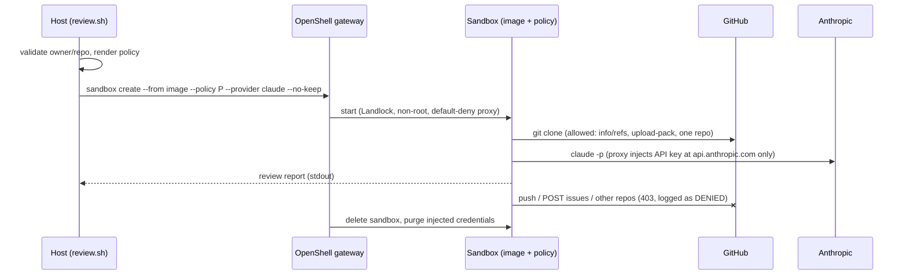

# Architecture

OpenShell is an **Execution Security Layer** placed *under* task routing. It is not an AI router and
not a model tier.

```
┌──────────────────────────────┐
│ Task Routing Layer           │   decides WHO does the work
│ multi-ai-workflow            │
│ ChatGPT / Codex / Claude /   │
│ Antigravity / Qwen           │
└──────────────┬───────────────┘
               ▼
┌──────────────────────────────┐
│ Execution Security Layer     │   decides WHAT the agent may do
│ NVIDIA OpenShell             │
└──────────────┬───────────────┘
               ▼
┌──────────────────────────────┐
│ Claude Code Reviewer         │
│ GitHub READ   (one repo)     │
│ GitHub WRITE  DENY           │
│ Host FS       DENY           │
│ Network       allowlist      │
└──────────────────────────────┘
```



## Components

| Path | Role |
|---|---|
| `image/Dockerfile` | Claude Code + git, non-root uid 1500, reviewer prompt baked in |
| `policies/claude-reviewer.yaml` | Template: filesystem, Landlock, process identity, per-repo GitHub read rules |
| `profiles/claude-code-reviewer.yaml` | Provider profile: Anthropic key bound to `api.anthropic.com` (no telemetry hosts) |
| `profiles/github-reviewer.yaml` | Optional endpointless token profile, bound by the policy to the one target repo |
| `scripts/` | `setup`, `review`, `status`, `verify-security`, `cleanup` plus CI helpers |

## Design decisions

- **Ephemeral sandbox per review.** No state or credentials persist; each run starts from the same image and policy.
- **Policy rendered per target.** `owner/repo` is regex-validated before it is interpolated into the
  policy and the sandbox command.
- **Endpointless GitHub profile.** A normal profile would let the token work on all of `github.com`.
  Binding it from the policy confines it to one repository's paths.
- **Deny rules on top of allow rules.** `git-receive-pack` is denied explicitly so a future edit that widens
  an allow rule cannot silently enable push.
- **No new abstractions.** Claude Code reviewer only (YAGNI). Other agents are out of scope.
